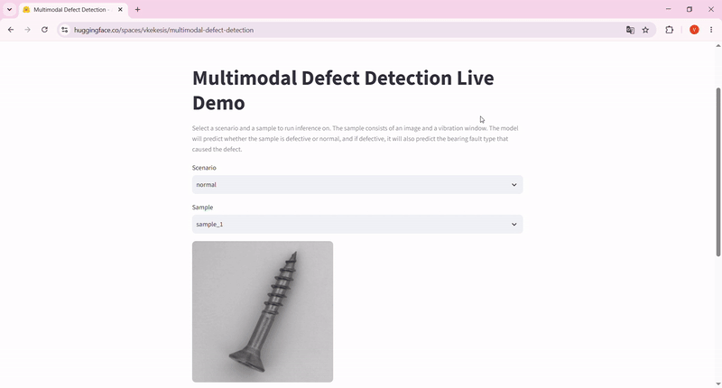
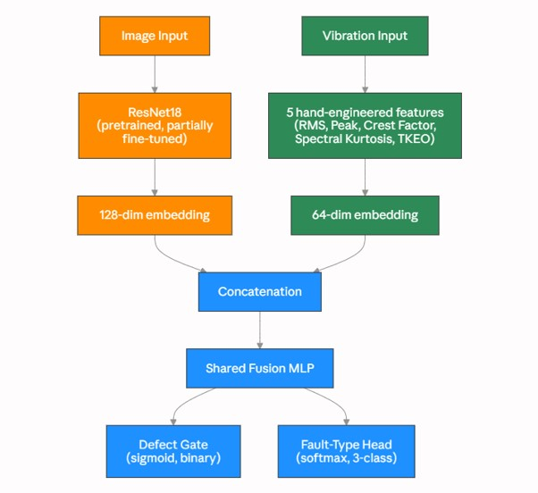
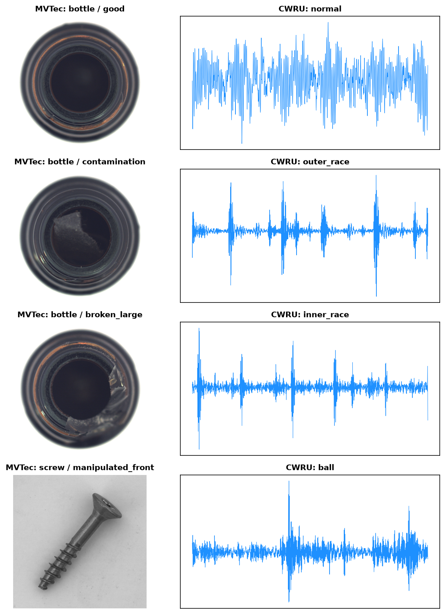
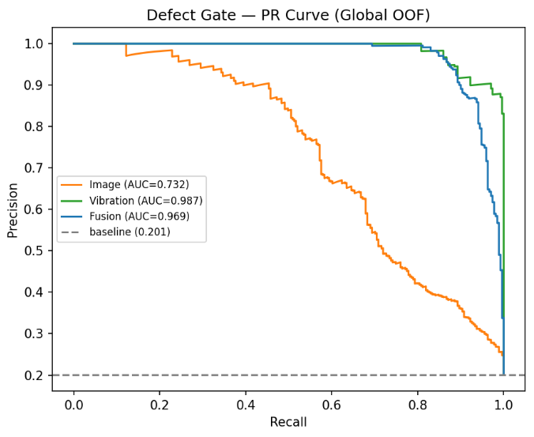
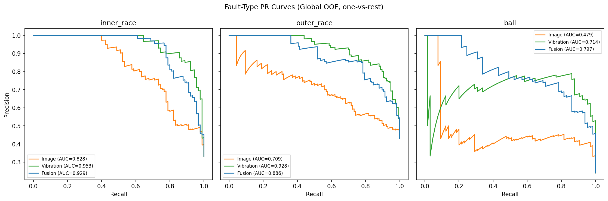
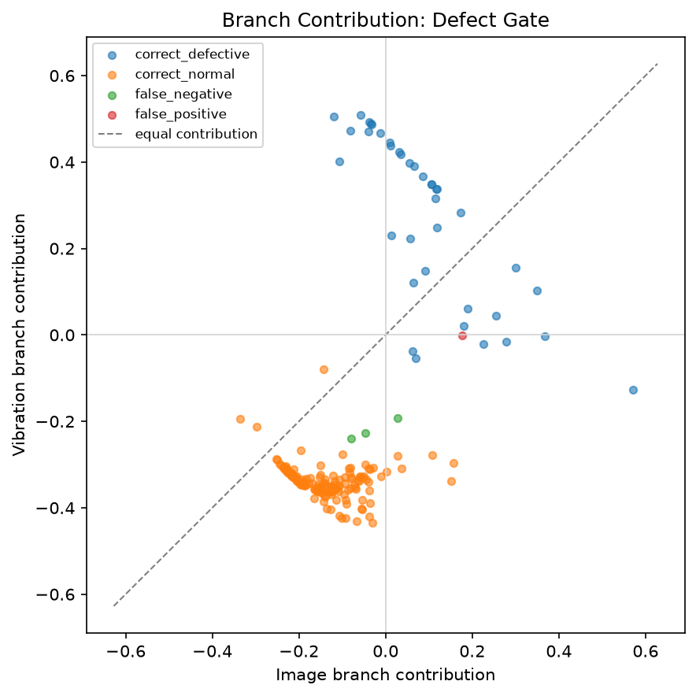
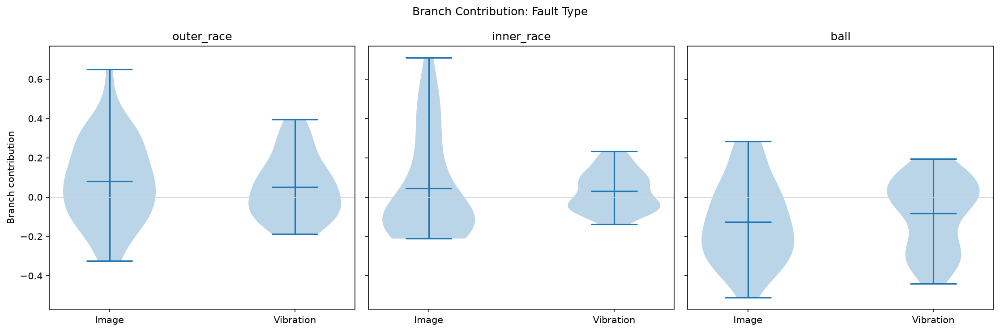
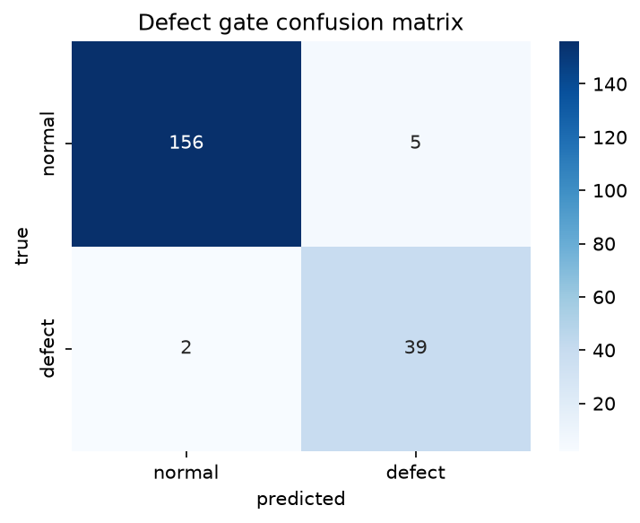
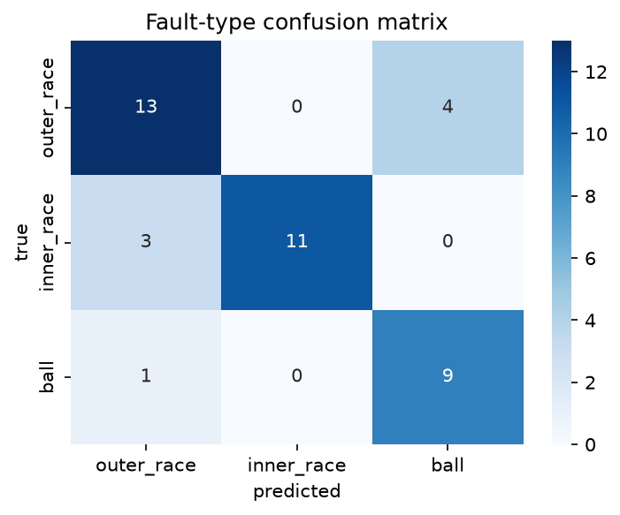
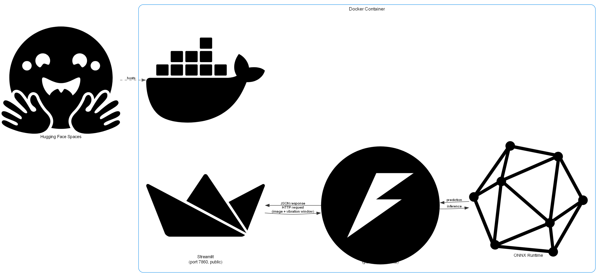

# Multimodal Defect Detection

## About The Project

**Hypothesis.** This project is based on a hypothetical scenario commonly observed in assembly lines. In this scenario there is a machine, which produces different industrial components. The machine uses a bearing, which can have different fault types. When the bearing becomes faulty, this causes the production of defective industrial components. In this project we assume that the production of a defective part is always attributed to a faulty bearing.

**Goal.** Detect defective industrial components from real-time inspection data and classify *which* specific bearing fault type caused the defect by combining a photo of the component with a vibration sensor reading produced by the bearing, since real-world quality-control lines typically have both signals available, not just one.

**Methodology.** A fusion model combines a CNN image branch with a vibration branch (5 statistical features computed from vibration signals) through a shared network, producing two outputs: a binary defect flag and, if defective, a specific fault-type classification. Rather than reporting a single trained model's accuracy, this project treats *model selection itself* as an evidence-based question by comparing vibration-only, image-only, and fusion variants through cross-validation, robustness diagnostics, and multiple interpretability methods (Grad-CAM, SHAP, exact Shapley branch attribution) before deciding which model to actually deploy, and why.

**Desired Outcome.** A model that reliably catches real defects and correctly classifies bearing fault type, backed by a transparent, reproducible decision trail rather than a single reported number and deployed as a live demo in Hugging Face spaces.


## Tech Stack

<div align="center">


</div>

## Demo

<div align="center">
  

  <sub>Selecting a held-out test sample and running it through the deployed model, no file upload needed.</sub>
</div>

## Live Demo

[](https://huggingface.co/spaces/vkekesis/multimodal-defect-detection)


The Space runs on free-tier hardware and sleeps after a period of inactivity. The first visit may take 30-60 seconds while it wakes up. After that, inference runs at ordinary speed (~55-99ms per prediction).

## Key Results

Final metrics on a fully held-out test set, measured on the actual deployed model, at its tuned decision threshold.

| Metric | Result |
|---|---|
| **Defect recall** | **95.1%** |
| Defect precision | 88.6% |
| Fault-type macro F1 | 0.809 |

Recall was the metric explicitly optimized for, since a missed real defect is costlier than a false alarm. The threshold was tuned specifically to guarantee it, not just measured after the fact.

## Architecture

A shared fusion model combines a CNN-based image branch with a lightweight vibration-feature branch, producing two outputs from one forward pass: a binary defect flag and, if defective, a fault-type classification.

<div align="center">
  
</div>

For the exact, op-level graph of the deployed ONNX model (every layer and tensor shape) — [see the full exported graph](assets/fusion_model.png).

## Dataset

Two independently collected, publicly available datasets are combined:

- **[MVTec AD](https://www.mvtec.com/company/research/datasets/mvtec-ad)**: real industrial component photos across multiple object categories, with pixel-level ground-truth defect masks.
- **[CWRU Bearing Dataset](https://engineering.case.edu/bearingdatacenter)** (Case Western Reserve University): real bearing vibration recordings, covering normal operation and three fault types (outer race, inner race, ball) across multiple severities.

**These two datasets were never collected together**: no real-world pairing between a specific photo and a specific vibration reading exists. The manifest construction pairs each MVTec image with a CWRU vibration file/window matching its fault type (severity and window chosen at random from the matching pool), producing a synthetic but fault-type-consistent multimodal dataset. This is a deliberate design choice, not a hidden limitation.

| MVTec defect type (examples) | | CWRU fault class |
|---|---|---|
| `bottle/broken_large`, `capsule/crack` | | `outer_race` |
| `metal_nut/bent`, `screw/thread_side` | | `inner_race` |
| `pill/scratch`, `tile/gray_stroke` | | `ball` |
| `good` (all categories) | | `normal` (no fault) |

*(Full category-to-fault-class mapping: see `config/data_config.yaml`)*

<div align="center">
  

  <sub>Four real manifest rows: each MVTec image (left) paired with its actual CWRU vibration window (right).</sub>
</div>


## Model Comparison

All three model variations (Image-only, Vibration-only, and Multimodal Fusion) were tested using stratified 3-fold cross-validation. 

### 1. Cross-Validation Metrics
*The table below highlights the performance across the binary Defect Gate and the multi-class Fault classifier. Bold values indicate the highest performance.*

| Modality | Defect F1 | Defect Recall | Fault Macro-F1 |
| :--- | :--- | :--- | :--- |
| **Vibration-Only** | **0.919 ± 0.027** | **0.919 ± 0.022** | **0.820 ± 0.014** |
| **Multimodal Fusion** | 0.912 ± 0.051 | 0.890 ± 0.063 | 0.789 ± 0.054 |
| **Image-Only**| 0.596 ± 0.066 | 0.690 ± 0.071 | 0.626 ± 0.056 |

<br>

### 2. Precision-Recall Performance
*Out-of-fold predictions were used to generate robust PR curves, isolating the Defect Gate behavior (left) and the specific Fault Class behavior (right).*

<div align="center">
  <!-- Adjusted widths and added breaks to stack the images proportionally -->
  
  <br><br>
  
</div>
<br>

### 3. Results Interpretation

From the PR curves, it is clear that the image-only baseline yields the lowest predictive performance. The vibration-only model achieves the highest aggregate cross-validation metrics, dominating massive structural defects like Inner Race (AUC 0.953) and Outer Race (AUC 0.928) faults where physical accelerometers easily capture loud, periodic impact frequencies. However, the true value of the architecture emerges with the multimodal fusion model on highly occluded, weak-signal ball faults. The vibration-only model struggles heavily given the sharp initial dip in its PR curve, indicating its most confident predictions were actually false positives caused by misleading background vibrations being mistaken for ball faults. The extreme visual severity of this dip and the jagged "staircase" pattern are also explained by the small sample size of ball faults, where even a single early false positive drastically crashes precision. By combining noisy vibration signals with image data, the fusion model successfully excludes those false positives, rescuing the hardest classification task and delivering a performance leap (AUC 0.797) while accepting only a slight "modality noise" degradation on the macroscopic faults.


## Model Interpretability

To ensure the multimodal architecture learned genuine physical representations rather than exploiting dataset artifacts, branch contribution analysis was conducted across the test set predictions. 

### 1. Dynamic Modality Weighting (Defect Gate)
*The scatter plot below evaluates how the network balances the Image and Vibration branches when making a binary Healthy vs. Defective decision. Branch contribution is quantified via exact 2-player Shapley attribution, where each sample's prediction is decomposed into the marginal effect of the image branch versus the vibration branch*

<div>
  
</div>
<br>

The distribution confirms the architecture avoids "lazy" static averaging by dynamically shifting its reliance between modalities based on signal clarity. Specifically, true positive defects cluster distinctly away from the equal-contribution axis, demonstrating that the network correctly learns to prioritize structural vibration data over image data when a definitive mechanical anomaly is present.

### 2. Feature Variance & Modality Noise (Fault Types)
*The violin plots below break down the distribution of branch contributions globally across specific fault classes.*

<div>
  
</div>
<br>

For macroscopic structural defects (`inner_race`, `outer_race`), the Image branch exhibits massive variance compared to the highly consistent Vibration branch, directly illustrating the "modality noise" that slightly degrades performance on easy faults. On the other hand, for highly occluded `ball` faults, the Vibration branch loses its tight consistency, forcing the model to dynamically combine both high-variance modalities to successfully rescue the hardest classification task.


## Model Selection

While the vibration-only model achieved marginally higher aggregate cross-validation scores, the **Multimodal Fusion** model was selected for final deployment because it fixes the system's biggest blind spot. 

The vibration-only model is excellent at catching obvious, heavy damage (race faults), but it struggles to detect the weak, hidden signals of a broken ball. By adding camera data, the fusion model successfully catches those elusive ball defects. We deliberately sacrificed a tiny bit of predictive performance on the easy faults to guarantee the system does not miss the hardest, most unpredictable ones.

### Final Deployment Performance
*The confusion matrices below illustrate the deployed Fusion model's exact predictive behavior across both the binary early-exit gate and the multi-class root cause classifier on the test set.*

<div align="center">
  
  
</div>
<br>

In production, the high-recall binary gate prioritized safety by successfully intercepting 39 out of 41 defects, ensuring virtually no degraded components passed undetected. Furthermore, the multi-class classifier confirmed the ultimate success of the fusion strategy by correctly identifying 90% (9 out of 10) of the highly elusive ball faults.


## Deployment Architecture

The trained fusion model is exported to ONNX and served from a single Docker container running two coordinated processes: FastAPI (internal only, ONNX Runtime CPU inference) and Streamlit (the public-facing app). The container has the exported `.onnx` model and a from-scratch NumPy/SciPy reimplementation of the training-time preprocessing, verified end-to-end against the original pipeline before deployment.

<div align="center">
  

  <sub>Streamlit (port 7860, public) calls FastAPI (port 8000, internal) over HTTP; FastAPI runs inference via ONNX Runtime and returns the result.</sub>
</div>


## Quickstart

Clone and install (Python 3.10+):

```bash
git clone https://github.com/<your-username>/multimodal-defect-detection.git
cd multimodal-defect-detection
pip install -e .
```

Run the deployed app locally:

```bash
cd deployment
docker build -t defect-detection-demo .
docker run -p 7860:7860 defect-detection-demo
```
Then open `http://localhost:7860`.

<details>
<summary>Reproducing the full pipeline from raw data (optional, requires Kaggle API credentials)</summary>

```bash
python scripts/data_ingestion.py
python scripts/build_manifest.py
python scripts/split_manifest.py
python scripts/train_model.py --modality both
python scripts/export_onnx.py
```

</details>


## Contact

**[Vasilis Kekesis]**
[Email](mailto:vassilios.kekessis@gmail.com) · [LinkedIn](https://www.linkedin.com/in/vasileios-kekesis-0135ab1b9/) · [GitHub](https://github.com/VassilisK2001)